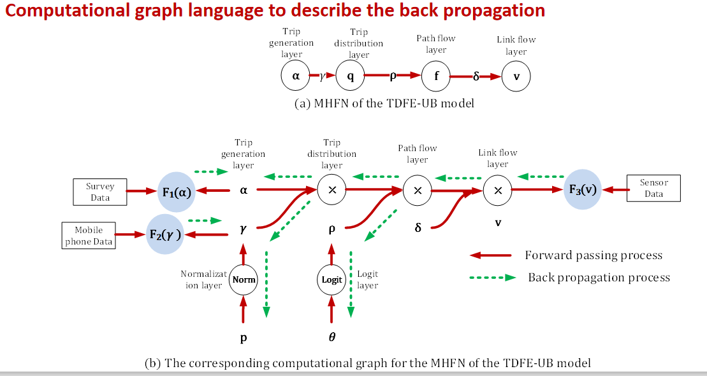
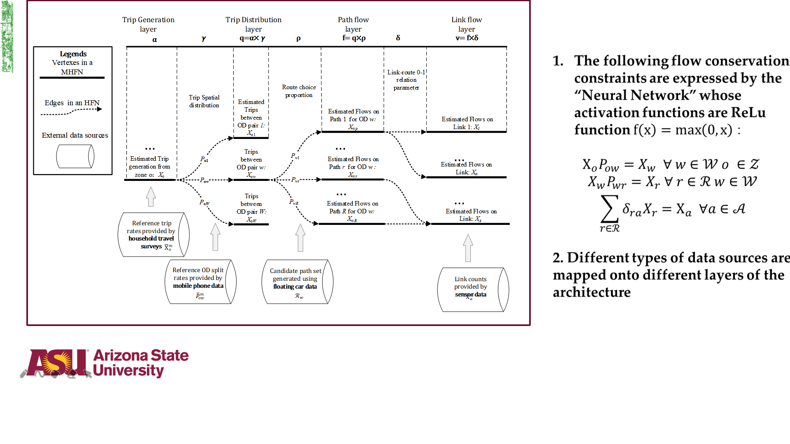

This source code, originally contributed by Dr. Xin (Bruce) Wu, aims to demonstarte how to integrate deep learning methods with transportation modeling, using a Computational Graph-based approach with multiple data sources.

#Key highlights and questions to be addressed:

#Challenges in planning modal calibration with multiple data sources

#What is Deep Learning from transportation model calibration perspective?

#What are a layered computationa graph and back propagation methods?

#Steps for integrating ML/CG in transportation 4-step model calibration 

#Simultaneous Forecasting Model Using an Econometric model +Deep Neural Network

#Published journal paper: 
Hierarchical travel demand estimation using multiple data sources: A forward and backward propagation algorithmic framework on a layered computational graph. TR Part C.
You can find a version of this paper and user guide at folder https://github.com/xzhou99/BTCG/tree/master/doc. 
A related presentation can be found from TOMNET-UTC at Arizona State University:
https://www.tomnet-utc.org/uploads/5/0/5/4/5054275/tomnet_leadership_webinar_series_feb012019.pdf

#What is GMNS?
General Travel Network Format Specification is a product of Zephyr Foundation, which aims to advance the field through flexible and efficient support, education, guidance, encouragement, and incubation.
Further Details in https://zephyrtransport.org/projects/2-network-standard-and-tools/
The underlying network uses GMNS format.

#How to start
One can start working on a simple example using the hypothetic Sinoux Fall network, and then visualize the network and estimation result in NeXTA: https://github.com/xzhou99/NeXTA-GMNS

